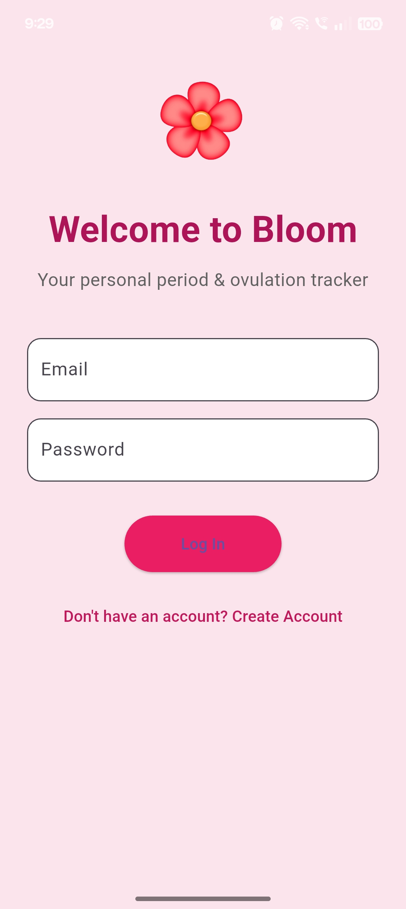
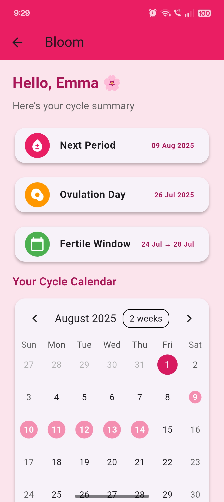

🌸 Bloom App

A Period Tracking UI App built with Flutter, designed to provide an elegant and user-friendly interface for cycle and health tracking.
This project focuses on showcasing the UI screens of a modern wellness app.

📱 Screenshots

    

✨ Key Highlights

🌸 Beautiful and minimal UI for period & cycle tracking

📆 Calendar view for cycle overview

📝 Log symptoms, moods, and notes (UI only)

🔔 Reminder & notification designs for important days

📊 Insights and analytics-style UI for trends (design showcase)

📱 Cross-platform responsive design with Flutter

🚀 About This Repository

This repository is UI showcase only — no tracking or backend functionality is included.
It is meant to demonstrate clean and modern screen designs for a period tracking app.

📬 Contact

If you’re interested in this project or would like to collaborate, feel free to reach out!
